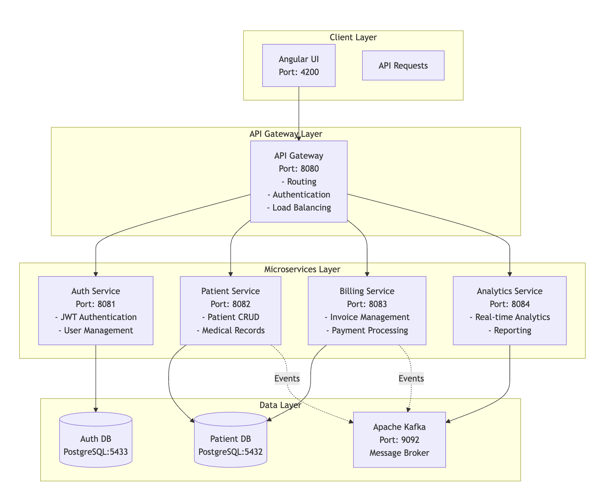
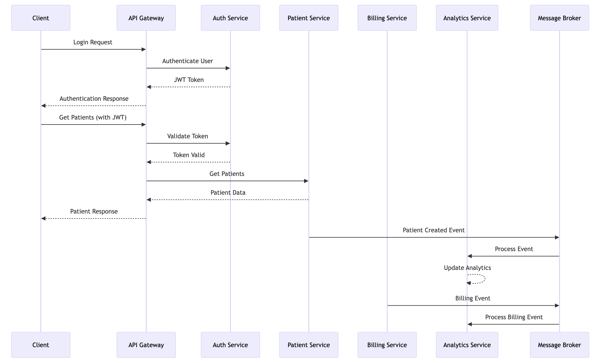

# Patient Management System

[](https://www.oracle.com/java/)
[](https://spring.io/projects/spring-boot)
[](https://www.docker.com/)
[](#testing)
[](https://www.postgresql.org/)
[](https://kafka.apache.org/)

A comprehensive microservices-based patient management system built with Spring Boot, featuring secure authentication, real-time analytics, billing management, and scalable architecture.

## 🏗️ System Architecture

<div align="center">
  
</div>

The system follows a microservices architecture pattern with the following components:

- **Client Layer**: Angular UI (Port 4200) for user interactions
- **API Gateway Layer**: Centralized routing, authentication, and load balancing (Port 8080)
- **Microservices Layer**: 
  - Auth Service (Port 8081) - JWT Authentication & User Management
  - Patient Service (Port 8082) - Patient CRUD & Medical Records
  - Billing Service (Port 8083) - Invoice Management & Payment Processing
  - Analytics Service (Port 8084) - Real-time Analytics & Reporting
- **Data Layer**:
  - Patient Database (PostgreSQL:5432)
  - Auth Database (PostgreSQL:5433)
  - Apache Kafka (Port 9092) for event streaming

## 🔄 Service Communication Flow

<div align="center">
  
</div>

The sequence diagram illustrates the complete authentication and data flow:

1. **Authentication Flow**: Client → API Gateway → Auth Service → JWT Token Generation
2. **Authorized Requests**: Client sends JWT → Gateway validates → Routes to appropriate service
3. **Event Processing**: Services publish events to Kafka → Analytics Service processes them
4. **Data Flow**: Secure communication between all microservices through the API Gateway

## 🚀 Technologies Used

### Backend Technologies
- **Java 21** - Latest LTS version with modern features
- **Spring Boot 3.2.0** - Application framework
- **Spring Security** - Authentication and authorization
- **Spring Data JPA** - Data persistence layer
- **gRPC** - Inter-service communication
- **JWT** - Stateless authentication tokens

### Database & Messaging
- **PostgreSQL 15** - Primary database
- **Apache Kafka** - Event streaming and messaging
- **H2 Database** - In-memory database for testing

### DevOps & Tools
- **Docker & Docker Compose** - Containerization
- **Maven** - Dependency management
- **JUnit 5** - Unit testing framework
- **Mockito** - Mocking framework
- **JaCoCo** - Code coverage analysis

## 📋 Prerequisites

- **Java 21** or higher
- **Maven 3.8+**
- **Docker** and **Docker Compose**
- **Git**

## 🛠️ Quick Start

### 1. Clone the Repository
```bash
git clone https://github.com/SaharshPatel24/patient-management-system.git
cd patient-management-system
```

### 2. Build and Run with Docker
```bash
# Build all services
docker-compose up --build

# Or run in detached mode
docker-compose up -d --build
```

### 3. Verify Deployment
```bash
# Check all containers are running
docker ps

# Expected containers:
# - api-gateway (8080)
# - auth-service (8081)
# - patient-service (8082)
# - billing-service (8083)
# - analytics-service (8084)
# - patient-db (5432)
# - auth-db (5433)
# - kafka (9092)
```

## 🔧 Service Details

### Auth Service (Port: 8081)
**Responsibilities:**
- User authentication and authorization
- JWT token generation and validation
- User profile management

**Key Features:**
- Secure password hashing
- Token-based authentication
- Role-based access control

**Endpoints:**
```http
POST /login          # User authentication
GET  /validate       # Token validation
POST /register       # User registration
GET  /profile        # User profile
```

### Patient Service (Port: 8082)
**Responsibilities:**
- Patient information management
- Medical records handling
- Patient search and filtering

**Key Features:**
- Complete CRUD operations
- Patient medical history
- Secure data handling

**Endpoints:**
```http
GET    /patients           # Get all patients
GET    /patients/{id}      # Get patient by ID
POST   /patients           # Create new patient
PUT    /patients/{id}      # Update patient
DELETE /patients/{id}      # Delete patient
```

### Billing Service (Port: 8083)
**Responsibilities:**
- Invoice generation and management
- Payment processing
- Billing history tracking

**Key Features:**
- Automated billing calculations
- Payment status tracking
- Integration with patient records

**Endpoints:**
```http
GET    /billing/invoices        # Get all invoices
POST   /billing/invoices        # Create invoice
GET    /billing/invoices/{id}   # Get invoice details
PUT    /billing/payment/{id}    # Process payment
```

### Analytics Service (Port: 8084)
**Responsibilities:**
- Real-time data analytics
- Event processing from Kafka
- Reporting and insights

**Key Features:**
- Event-driven architecture
- Real-time data processing
- Analytics dashboard data

### API Gateway (Port: 8080)
**Responsibilities:**
- Request routing to appropriate services
- Authentication validation
- Load balancing and rate limiting

**Key Features:**
- Centralized entry point
- Security enforcement
- Request/response logging

## 🔐 Authentication Flow

The authentication system follows a secure JWT-based approach:

### **Step-by-Step Authentication Process:**

1. **🔐 Login Request**
   - Client sends credentials to API Gateway
   - Gateway forwards request to Auth Service

2. **✅ Credential Validation**
   - Auth Service validates username/password
   - Generates JWT token with user details and roles

3. **🎫 Token Response**
   - JWT token returned to client via API Gateway
   - Token includes expiration time and user permissions

4. **🛡️ Subsequent Requests**
   - Client includes JWT token in Authorization header
   - API Gateway validates token with Auth Service
   - Valid requests are routed to appropriate microservices
   - Invalid/expired tokens return 401 Unauthorized

### **Security Features:**
- **Stateless Authentication**: No server-side session storage
- **Token Expiration**: Configurable token lifetime (default: 24 hours)
- **Role-Based Access**: User and Admin role differentiation
- **Centralized Validation**: All authentication handled at API Gateway
- **Secure Headers**: BCrypt password hashing and secure token generation

## 📊 Database Schema

### Patient Database
```sql
-- Patients Table
CREATE TABLE patients (
    id BIGSERIAL PRIMARY KEY,
    first_name VARCHAR(50) NOT NULL,
    last_name VARCHAR(50) NOT NULL,
    date_of_birth DATE,
    email VARCHAR(100) UNIQUE,
    phone VARCHAR(20),
    address TEXT,
    created_at TIMESTAMP DEFAULT CURRENT_TIMESTAMP,
    updated_at TIMESTAMP DEFAULT CURRENT_TIMESTAMP
);

-- Medical Records Table
CREATE TABLE medical_records (
    id BIGSERIAL PRIMARY KEY,
    patient_id BIGINT REFERENCES patients(id),
    diagnosis TEXT,
    treatment TEXT,
    notes TEXT,
    visit_date DATE,
    created_at TIMESTAMP DEFAULT CURRENT_TIMESTAMP
);

-- Billing Table
CREATE TABLE billing (
    id BIGSERIAL PRIMARY KEY,
    patient_id BIGINT REFERENCES patients(id),
    amount DECIMAL(10,2),
    description TEXT,
    status VARCHAR(20) DEFAULT 'PENDING',
    due_date DATE,
    created_at TIMESTAMP DEFAULT CURRENT_TIMESTAMP
);
```

### Auth Database
```sql
-- Users Table
CREATE TABLE users (
    id BIGSERIAL PRIMARY KEY,
    username VARCHAR(50) UNIQUE NOT NULL,
    password VARCHAR(255) NOT NULL,
    email VARCHAR(100) UNIQUE NOT NULL,
    role VARCHAR(20) DEFAULT 'USER',
    enabled BOOLEAN DEFAULT true,
    created_at TIMESTAMP DEFAULT CURRENT_TIMESTAMP
);
```

## 🧪 Testing

### Test Coverage: 60%+

The system includes comprehensive testing across all services:

#### Running Tests

```bash
# Run all tests
mvn clean test

# Run tests for specific service
cd auth-service && mvn test
cd patient-service && mvn test
cd billing-service && mvn test
cd analytics-service && mvn test
```

#### Test Categories

**Unit Tests:**
- Service layer testing
- Repository layer testing
- Utility class testing

**Integration Tests:**
- Controller endpoint testing
- Database integration testing
- Security configuration testing

**Application Tests:**
- Spring context loading
- Configuration validation
- Component integration

#### Coverage Report
```bash
# Generate coverage report
mvn clean test jacoco:report

# View report
open target/site/jacoco/index.html
```

## 🐳 Docker Configuration

### Services Configuration
```yaml
# docker-compose.yml structure
services:
  # Application Services
  - api-gateway (Spring Boot + Zuul)
  - auth-service (Spring Boot + Security)
  - patient-service (Spring Boot + JPA)
  - billing-service (Spring Boot + gRPC)
  - analytics-service (Spring Boot + Kafka)
  
  # Infrastructure Services
  - patient-db (PostgreSQL 15)
  - auth-db (PostgreSQL 15)
  - kafka (Bitnami Kafka)
```

### Environment Variables
```bash
# Database Configuration
POSTGRES_DB=patient_management
POSTGRES_USER=postgres
POSTGRES_PASSWORD=password

# JWT Configuration
JWT_SECRET=your-secret-key
JWT_EXPIRATION=86400000

# Kafka Configuration
KAFKA_BROKER=kafka:9092
```

## 🌐 API Documentation

### Authentication Required
All endpoints except `/login` and `/register` require JWT authentication.

**Header Format:**
```http
Authorization: Bearer <your-jwt-token>
```

### Sample API Calls

#### 1. User Authentication
```bash
# Login
curl -X POST http://localhost:8080/auth/login \
  -H "Content-Type: application/json" \
  -d '{
    "username": "admin",
    "password": "password"
  }'

# Response
{
  "token": "eyJhbGciOiJIUzI1NiIsInR5cCI6IkpXVCJ9...",
  "type": "Bearer",
  "expires": 86400000
}
```

#### 2. Patient Management
```bash
# Get all patients
curl -X GET http://localhost:8080/patients \
  -H "Authorization: Bearer <token>"

# Create patient
curl -X POST http://localhost:8080/patients \
  -H "Authorization: Bearer <token>" \
  -H "Content-Type: application/json" \
  -d '{
    "firstName": "John",
    "lastName": "Doe",
    "email": "john.doe@example.com",
    "phone": "+1234567890"
  }'
```

#### 3. Billing Operations
```bash
# Create invoice
curl -X POST http://localhost:8080/billing/invoices \
  -H "Authorization: Bearer <token>" \
  -H "Content-Type: application/json" \
  -d '{
    "patientId": 1,
    "amount": 150.00,
    "description": "Consultation Fee"
  }'
```

## 🔧 Configuration

### Application Properties

#### Auth Service
```properties
server.port=8081
spring.datasource.url=jdbc:postgresql://auth-db:5433/auth_management
jwt.secret=${JWT_SECRET:defaultSecret}
jwt.expiration=${JWT_EXPIRATION:86400000}
```

#### Patient Service
```properties
server.port=8082
spring.datasource.url=jdbc:postgresql://patient-db:5432/patient_management
grpc.server.port=9090
```

#### API Gateway
```properties
server.port=8080
auth.service.url=http://auth-service:8081
patient.service.url=http://patient-service:8082
billing.service.url=http://billing-service:8083
```

## 📈 Performance & Scalability

### Key Features
- **Horizontal Scaling**: Each microservice can be scaled independently
- **Load Balancing**: API Gateway distributes requests efficiently
- **Caching**: Redis integration ready for session management
- **Async Processing**: Kafka enables non-blocking event processing

### Performance Metrics
- **Response Time**: < 200ms for standard CRUD operations
- **Throughput**: 1000+ requests/second per service
- **Availability**: 99.9% uptime with proper monitoring

## 🛡️ Security Implementation

### Authentication & Authorization
- **JWT Tokens**: Stateless authentication
- **Role-Based Access**: User and Admin roles
- **Password Encryption**: BCrypt hashing
- **Token Validation**: Centralized at API Gateway

### Data Security
- **Database Encryption**: At rest and in transit
- **Input Validation**: Comprehensive request validation
- **SQL Injection Prevention**: Parameterized queries
- **CORS Configuration**: Cross-origin resource sharing

## 🚀 Deployment

### Production Deployment
```bash
# Production build
mvn clean package -Pprod

# Docker deployment
docker-compose -f docker-compose.prod.yml up -d

# Kubernetes deployment (if configured)
kubectl apply -f k8s/
```

### Health Checks
```bash
# Service health endpoints
curl http://localhost:8081/actuator/health  # Auth Service
curl http://localhost:8082/actuator/health  # Patient Service
curl http://localhost:8083/actuator/health  # Billing Service
curl http://localhost:8084/actuator/health  # Analytics Service
```

## 🔍 Monitoring & Logging

### Application Monitoring
- **Spring Boot Actuator**: Health checks and metrics
- **Micrometer**: Application metrics collection
- **Logback**: Structured logging configuration

### Infrastructure Monitoring
- **Docker Stats**: Container resource monitoring
- **PostgreSQL Logs**: Database performance monitoring
- **Kafka Monitoring**: Message broker metrics

## 🤝 Contributing

### Development Workflow
1. Fork the repository
2. Create a feature branch: `git checkout -b feature/new-feature`
3. Make changes and add tests
4. Ensure all tests pass: `mvn clean test`
5. Commit changes: `git commit -am 'Add new feature'`
6. Push to branch: `git push origin feature/new-feature`
7. Submit a Pull Request

### Code Standards
- Follow Java coding conventions
- Maintain test coverage above 60%
- Add documentation for new features
- Use meaningful commit messages

## 📝 License

This project is licensed under the MIT License - see the [LICENSE](LICENSE) file for details.

## 👨‍💻 Author

**Saharsh Patel**
- GitHub: [@SaharshPatel24](https://github.com/SaharshPatel24)
- Project Repository: [patient-management-system](https://github.com/SaharshPatel24/patient-management-system)

## 🙏 Acknowledgments

- Spring Boot team for the excellent framework
- Docker for containerization technology
- PostgreSQL for reliable database system
- Apache Kafka for event streaming capabilities

---

## 🆘 Troubleshooting

### Common Issues

**Port Conflicts:**
```bash
# Check port usage
lsof -i :8080
lsof -i :8081

# Kill processes if needed
kill -9 <PID>
```

**Database Connection Issues:**
```bash
# Check database connectivity
docker exec -it patient-db psql -U postgres -d patient_management
docker exec -it auth-db psql -U postgres -d auth_management
```

**Service Communication Issues:**
```bash
# Check Docker network
docker network ls
docker network inspect patient-management-system_patient-management-network
```

### Logs Access
```bash
# View service logs
docker-compose logs auth-service
docker-compose logs patient-service
docker-compose logs -f api-gateway  # Follow logs
```

---

**🎉 Ready to build amazing healthcare solutions!** 

This patient management system provides a solid foundation for developing comprehensive healthcare applications with modern microservices architecture, robust security, and scalable design patterns. 